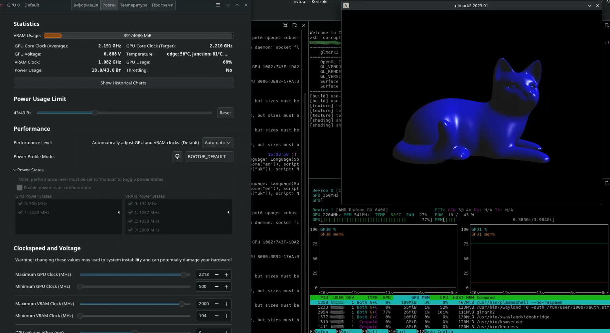

# amdgpu-custom-ppt
Patches and instructions for using custom AMDGPU PowerPlay Tables (PPT) via SMU during early boot.

# ⚠️ Disclaimer

All steps, patches, and scripts described in this guide are provided for educational and experimental purposes only.

By following these instructions, you acknowledge that:
- You proceed at your own risk.
- The author is not responsible for any damage to your hardware, software, or data.
- Improper use of custom PowerPlay Tables, kernel patches, or driver modifications may cause:
  - GPU instability or crashes
  - System freezes or data loss
  - Hardware damage

Always backup important data and ensure you have a way to restore your system before applying any changes.
Use these instructions only if you understand the risks and are comfortable troubleshooting issues.

# AMD PowerPlay Table
**NOTE:** 

**AMDGPU** module parameter `amdgpu.ppfeaturemask=0xffffffff` must be enabled via **grub** settings or via **module** settings.

There are two main ways (known to me) to modify AMD PowerPlay Tables:
1. Using [UPP](https://github.com/sibradzic/upp) to modify `/sys/class/drm/card0/device/pp_table` via sysfs.
2. Using a custom kernel with a patched amdgpu driver and loading a custom_ppt_1002_743f.bin file during early boot.

⚠️ Method 1 is unstable and can cause GPU freezes.

✅ Method 2 (custom kernel + patched `amdgpu`) is recommended.

## Setup AMDGPU module PowerPlay Feature Mask

### Method 1: AMDGPU module settings
1. Edit or create the file /etc/modprobe.d/amdgpu.conf
    ```
    options amdgpu ppfeaturemask=0xffffffff
    ```
2. Reboot to apply changes

### Method 2: Kernel command line (GRUB)
1. Edit /etc/default/grub and add the parameter
    ```
    GRUB_CMDLINE_LINUX_DEFAULT="quiet splash amdgpu.ppfeaturemask=0xffffffff"
    ```
2. Update grub
    ```
    update-grub
    ```
3. Reboot to apply changes

## PowerPlay Table via sysfs
This method is quick and easy, but unstable.

### Using UPP Utility

Please, follow official guide - [UPP](https://github.com/sibradzic/upp).

For reference, see the example script:
- [amd_gpu_overdrive_ppt_patch](scripts/amd_gpu_overdrive_ppt_patch.sh)

### Dump Binary PowerPlay Table via sysfs
You can also place the entire Custom PowerPlay Table binary into `pp_tables` file directly.

For reference, see:
- [amd_gpu_overdrive_ppt_patch_bin](scripts/amd_gpu_overdrive_ppt_patch_bin.sh)

## PowerPlay Table via Patched AMDGPU Module
Using a patched AMDGPU driver allows you to **load a custom PowerPlay Table during early boot**, which is **stable**.

### Rules for Custom PowerPlay Table

- Must be a binary file.
- Must be placed in `/lib/firmware/amdgpu/`.
- Must follow the naming template:
    ```
    custom_ppt_<VID>_<PID>.bin
    ```
Where:
- VID = vendor ID (hexadecimal)
- PID = device ID (hexadecimal)
Example: custom_ppt_1002_743f.bin

### Steps to Use Custom PowerPlay Table

1. Enable AMDGPU PowerPlay Feature Mask
2. Build or Rebuild AMDGPU
   - Build kernel with patched `amdgpu` module: [Build custom kernel](patches/README.md#building-a-debian-kernel-with-patched-amdgpu-driver)
   - Rebuild only `amdgpu` module: [ReBuild AMDGPU driver](patches/README.md#rebuilding-patched-amdgpu-driver)
3. Install Initramfs Hook to use Custom PowerPlay Table for kernel initramfs: [Initramfs hook](patches/README.md#initramfs-hook-add-custom-powerplay-table-into-initramfs)
4. Create valid Custom PowerPlay Table depends on your GPU: [Create Custom PowerPlay Table](ppt/README.md)

## AMDGPU Tuning

After completing the steps above, you should be able to use Linux tools such as LACT to tune GPU parameters, including:
- GPU clock (SCLK)
- Memory clock (MCLK)
- Power limits
- Voltage offsets
- Other overdrive settings

⚠️ Make sure your custom PowerPlay Table is loaded correctly before applying any changes, as improper settings may cause GPU instability.

Useful tools:
- [LACT: Linux GPU Control Application](https://github.com/ilya-zlobintsev/LACT)
    

### Overclock via CLI
1. Setup GPU frequency, example, 2218 Mhz:
    ```
    echo "s 1 2218" | tee /sys/class/drm/card1/device/pp_od_clk_voltage
    ```
2. Apply settings:
    ```
    echo "c" | tee /sys/class/drm/card1/device/pp_od_clk_voltage
    ```
